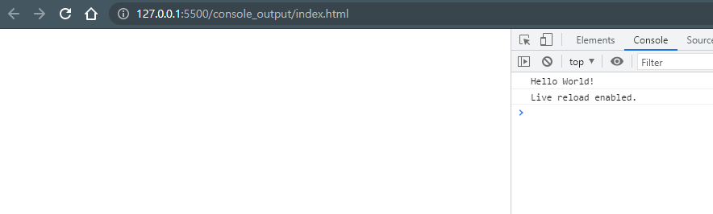

# Console Output

<a href="https://youtu.be/OCCpGh4ujb8">
2:10 variable 
4:30 block scope 
9:15 constant 
11:35 Variable types 
12:40 number 
15:10 infinity, NaN(not a number) 
16:25 bigInt 
17:25 string , ${variable} 
18:45 boolean 
19:20 null, undefined 
20:00 symbol 
21:40 dynamic typing 
